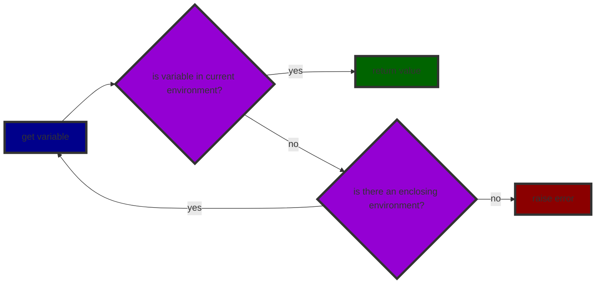
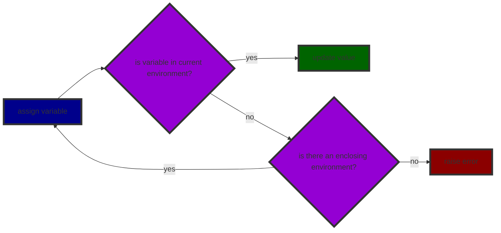
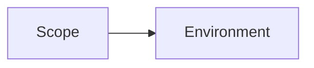

* [Environments](#environments)
  * [Defining variables](#defining-variables)
  * [Getting variables](#getting-variables)
  * [Assigning Variables](#assigning-variables)
  * [Scoping](#scoping)
    * [Cases to consider](#cases-to-consider)
  * [Scope Resolution](#scope-resolution)

# Environments

Environments are similar to sort of dictionary that maps keys to values. In our case environments will be used to map variable amd other declarations to their values.
Storing values in an environment allows us to keep them in memory and track them.


```python
@dataclasses.dataclass
class Environment:
    enclosing: t.Optional["Environment"] = None
    values: t.Dict[str, t.Any] = dataclasses.field(default_factory=dict)
```

Don't worry about `enclosing` field for now. It will be used later for scoping. For now let's focus on `values` field. It is a dictionary that maps variable names to their values.

```python
>>> var x = 10;
{ 'x': 10 }
```

## Defining variables

```python
    def define(self, name: "Token", value: t.Any, /) -> None:
        """Define a variable in the environment."""
        self.values[name.lexeme] = value
```

It takes in a `Token` object and a value. It then maps the lexeme of the token to the value in the `values` dictionary.
For example, if we have a token `Token(TokenType.IDENTIFIER, "x", None, 1, 1)` and a value `10`, then we will map `"x"` to `10` in the `values` dictionary.

For a quick recap, `TokenType.IDENTIFIER` is a token type that represents identifiers. Identifiers are names of variables, functions, classes, etc. `Token(TokenType.IDENTIFIER, "x", None, 1, 1)` is a token that represents an identifier with lexeme `"x"` and line number `1` and column number `1`.


## Getting variables

```python
    def get(self, name: "Token", /) -> t.Any:
        """Get a variable from the environment."""
        if name.lexeme in self.values:
            return self.values[name.lexeme]
        if self.enclosing:
            return self.enclosing.get(name)
        raise PyLoxRuntimeError(f"Undefined variable '{name.lexeme}'.")
```

Now that we can define variables, we need a way to get them. `get` method takes in a `Token` object and returns the value of the variable.
This part is a bit tricky which means we need to handle cases if the variable is not defined in the current environment and the variable is not defined at all.

Now the first case is easy to manage as we can just check if the variable is in the `values` dictionary. If it is, we can just return the value else we need to check if the variable is defined in the enclosing environment. If it is, we can just return the value from the enclosing environment. This is where `enclosing` field comes in handy. If the variable is not defined in the enclosing environment, we can raise an error.
So the process recursively checks if there is still an enclosing environment and if the variable is defined in the enclosing environment and calls upon itself till it finds the variable or there is no enclosing environment left.



Now what happens if we try to get a variable that is not defined at all?

We have to keep in mind that `referring` and `using` a variable are two different things. Referring to a variable means that we are using the variable in our code. Using a variable means that we are trying to get the value of the variable.  
Hence, we can refer to a variable that is not defined but we cannot use a variable that is not defined.

```js
fun foo() {
    return bar();
}

fun bar() {
    return 10;
}
```

Since making a static error makes it tough to define in cases such as recursive definitions, we will make it a runtime error.

```js
print a;
var a = "Oops!";
```

## Assigning Variables

```python
    def assign(self, name: "Token", value: t.Any, /) -> None:
        """Assign a variable in the environment."""
        if name.lexeme in self.values:
            self.values[name.lexeme] = value
            return
        if self.enclosing:
            self.enclosing.assign(name, value)
            return
        raise PyLoxRuntimeError(f"Undefined variable '{name.lexeme}'.")
```

Assigning variables is similar to getting variables. We first check if the variable is defined in the current environment. If it is, we just update the value of the variable. If it is not, we check if the variable is defined in the enclosing environment. If it is, we update the value of the variable in the enclosing environment. If it is not, we raise an error.



## Scoping

Scoping is a way to define the visibility of a variable. Multiple variables can have the same name but they can be defined in different scopes.
Scopes ensure the correct value is used based on its context.

`Lox` follows lexical scoping. Lexical scoping means that the scope of a variable is determined by its position in the source code.  

Scopes and environments are closely related. Each scope has its own environment. When we define a variable in a scope, we define it in the environment of that scope. When we get a variable, we get it from the environment of that scope.



### Cases to consider

- Nested scopes
- Redeclaration of variables (shadowing)

```js
var a = "global";

{
	var b = "block";
    print a; // global (nested)
    print b; // block
}
```

```js
var a = "global";

{
	var a = "block";  // shadowing
    print a; // block
}
```

## Scope Resolution

Now that we know the basics of scopes, and have made functions to define, get and assign variables, supporting arbitrary amounts of nesting we can now implement scope resolution.

Scope resolution is primarily for blocks. Essentially, a block is a list of statements and it in itself is also a statement.

So once we can have nested scopes, we can get, define and assign variables by recursively moving to the outer scope. But what if we know the scope we want to get, define or assign a variable in?

In such a case its inefficient and impractical to recursively move to the outer scope. Hence, we need a way to directly access the scope we want to get, define or assign a variable in.

```python
    def ancestor(self, distance: int, /) -> "Environment":
        """Get the ancestor of the current environment."""
        environment = self  # current environment
        for _ in range(distance):
            environment = environment.enclosing  # move to the enclosing environment
        return environment

    def get_at(self, distance: int, name: "Token", /) -> t.Any:
        """Get a variable from the environment."""
        return self.ancestor(distance).values[name.lexeme]  # get the value of the variable from the environment of the scope we want to get

    def assign_at(self, distance: int, name: "Token", value: t.Any, /) -> None:
        """Assign a variable in the environment."""
        self.ancestor(distance).values[name.lexeme] = value  # assign the value of the variable in the environment of the scope we want to assign
```

We can use the `ancestor` method to get the environment of the scope we want to get, by stating the distance of the scope from the current scope. We can then use the `get_at` method to get the value of the variable from the environment of the scope we want to get or the `assign_at` method to assign the value of the variable in the environment of the scope we want to assign.

A common use case for scope resolution is when we want to get say in our case the outer class from inside one of its methods.

<html lang="en">
    <style>
        .btn-blue {
            background-color: #3498db;
            border-color: #3498db;
            color: #fff;
            padding: 10px 20px;
            border-radius: 5px;
            text-decoration: none;
        }
        .btn-blue:hover {
            background-color: #2980b9;
            border-color: #2980b9;
            color: #fff;
        }
    </style>
    <a class="btn-blue" href="parser.html" style="float: left;">Previous: Parser</a>
    <a class="btn-blue" href="resolver.html" style="float: right;">Next: Resolver</a>
</html>
